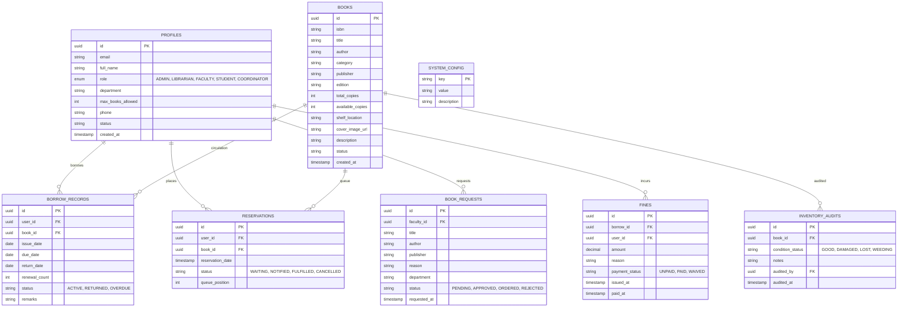

# 🚀 Next.js & Supabase Library Management System (LMS) - Migration & Implementation Plan

This document outlines the complete architectural redesign, database schema, and module-by-module implementation plan for migrating the Library Management System from a traditional **Java JSP / Servlet / MySQL** stack to a modern, state-of-the-art **Next.js 15 (App Router, TypeScript, Tailwind CSS, Lucide)** and **Supabase (PostgreSQL, Auth, Row-Level Security, Realtime)** application.

---

## 🏗️ Architecture & Technology Stack Comparison

| Component | Legacy Architecture | Modern Next.js + Supabase Architecture |
|---|---|---|
| **Frontend UI** | JSP, JSTL, Vanilla CSS/JS | **Next.js 15 (App Router)**, React 19, TypeScript, **Tailwind CSS**, Glassmorphism Design System, Lucide React Icons |
| **Backend / API** | Java Servlets, `web.xml` filters | **Next.js Server Actions & Route Handlers**, Supabase Client & Admin SDK |
| **Database** | MySQL 8.x (`lms_db`) | **Supabase PostgreSQL** with relational constraints, foreign keys, triggers, and JSONB support |
| **Authentication & RBAC** | Custom HTTP Session (`AuthFilter`) | **Supabase Auth** (JWT, secure cookies, SSR middleware, RBAC metadata) with fallback mock/instant demo login switcher |
| **Security** | Basic manual SQL Queries in DAOs | **Row-Level Security (RLS)** policies directly in PostgreSQL + typed Supabase client |
| **Realtime Updates** | Full page refresh / manual AJAX | **Supabase Realtime** for live book availability updates & instant circulation alerts |
| **Styling & UX** | Static JSP templates | Dynamic, glassmorphic dark/light UI with smooth micro-animations, responsive sidebar, data tables, modal dialogs, and instant toast notifications |

---

## 🗄️ Supabase PostgreSQL Database Architecture

The Supabase database schema replaces the MySQL schema with enhanced typing, automatic timestamps, enums, foreign keys, and RLS policies:



---

## 📦 Complete 14-Module Implementation Scope

### Module 1: User Authentication & Role-Based Access Control (RBAC)
- Multi-role support: **Admin**, **Librarian**, **Faculty**, **Student**, **Coordinator**.
- Supabase Auth integration + **1-Click Quick Login Role Switcher** for testing & demos.
- Next.js Middleware route protection and role-gated navigation.

### Module 2: Book Catalog & Inventory Management
- Full CRUD: Add, edit, archive, and delete books.
- Comprehensive attributes: ISBN barcode input, Title, Author, Category, Publisher, Edition, Total Copies, Shelf Location, Cover preview.
- Dynamic stock updates (auto-calculated `available_copies`).

### Module 3: Student & Faculty Management
- Member directory with live search and role/department filters.
- Add and edit user profiles, assign borrowing privilege limits (e.g. Students: 3, Faculty: 5, Admin/Librarian: unlimited).
- Member status controls (Active, Suspended, Graduated).

### Module 4: Advanced Live Search & Discovery
- Instant client-side & server-side faceted search by Keyword, Title, Author, Category, ISBN.
- Real-time availability indicator badge (In Stock, Limited Copies, Reserved, Checked Out).

### Module 5: Book Issue Management (Circulation Desk)
- Issue book modal with real-time stock validation and user quota limits verification.
- Configurable loan duration (e.g. 14 days for students, 30 days for faculty).
- Generation of loan receipt with due date computation.

### Module 6: Book Return & Renewal
- 1-click Return processing that immediately restores available copy count.
- Book loan renewal workflow with max renewal limit checks (e.g. max 2 renewals).
- Automatic overdue status flag if past due date.

### Module 7: Book Reservation & Waitlist Queue
- Allow students & faculty to place reservations on books with 0 available copies.
- Automated queue position ranking (1st, 2nd, 3rd in queue).
- Notification alert trigger when a returned book becomes ready for the next reserved user.

### Module 8: Faculty Book Acquisition Requests
- Faculty interface to submit requests for new academic books, research journals, and teaching resources.
- Librarian review dashboard: Approve, Reject, or mark as Ordered with budget and priority tags.

### Module 9: Department Resource Coordination & Analytics
- Department Coordinator portal to recommend required textbooks for specific academic semesters.
- Department-level resource allocation analytics and curriculum book lists.

### Module 10: Borrowing History & Central Audit Log
- **Personal History**: Individual history for Students and Faculty with active/returned/overdue tabs.
- **Central Circulation Audit Log**: Comprehensive master log for Librarians and Admins with date range filtering and CSV export.

### Module 11: Fine & Overdue Monitoring
- Automated daily fine calculation for overdue loans.
- Overdue alert badges on member profiles and checkout desk.
- Fine payment settlement and fee waiver actions by Librarian/Admin.

### Module 12: Analytics & Report Generation
- Visual dashboard charts (Borrowing trends over time, Most popular categories, Top borrowed books, Active vs Returned distribution).
- Exportable reports in CSV and formatted Printable views.

### Module 13: Inventory Management & Condition Audits
- Track damaged, missing, or decommissioned (weeded) books.
- Inventory audit log recording shelf audits and condition flags.

### Module 14: System Administration & Configuration
- Global settings manager: Borrow limits per role, loan durations, fine rates, library operating schedule.
- Database backup snapshot / SQL seed export utility.

---

## 📂 Proposed Folder Structure (`/lms-next`)

```
lms-next/
├── public/
├── src/
│   ├── app/
│   │   ├── (auth)/
│   │   │   └── login/page.tsx               # Modern Glassmorphic Login + Quick Switcher
│   │   ├── (dashboard)/
│   │   │   ├── layout.tsx                   # Role-Aware Sidebar, Topbar, Theme Toggle
│   │   │   ├── page.tsx                     # Role-tailored Dynamic Dashboard
│   │   │   ├── books/
│   │   │   │   ├── page.tsx                 # Catalog list & faceted search
│   │   │   │   ├── [id]/page.tsx            # Book detail view
│   │   │   │   └── add/page.tsx             # Add new book
│   │   │   ├── circulation/
│   │   │   │   ├── issue/page.tsx           # Book issue desk
│   │   │   │   ├── return/page.tsx          # Book return & renew desk
│   │   │   │   └── history/page.tsx         # Full circulation log
│   │   │   ├── members/
│   │   │   │   ├── page.tsx                 # Member directory
│   │   │   │   └── [id]/page.tsx            # Member profile & active loans
│   │   │   ├── reservations/
│   │   │   │   └── page.tsx                 # Waitlist & reservation queue (Module 7)
│   │   │   ├── requests/
│   │   │   │   └── page.tsx                 # Faculty acquisition requests (Module 8)
│   │   │   ├── department/
│   │   │   │   └── page.tsx                 # Coordinator department resources (Module 9)
│   │   │   ├── fines/
│   │   │   │   └── page.tsx                 # Overdue & fine manager (Module 11)
│   │   │   ├── reports/
│   │   │   │   └── page.tsx                 # Analytics & PDF/CSV export (Module 12)
│   │   │   ├── inventory/
│   │   │   │   └── page.tsx                 # Damaged/lost inventory audits (Module 13)
│   │   │   └── settings/
│   │   │       └── page.tsx                 # System configuration & policies (Module 14)
│   │   ├── globals.css                      # Tailwind & Glassmorphism design tokens
│   │   └── layout.tsx                       # Root layout (Fonts, Providers, Toaster)
│   ├── components/
│   │   ├── ui/                              # Buttons, Cards, Modals, Badges, Tabs
│   │   ├── layout/                          # Sidebar, Header, UserMenu, RoleBadge
│   │   ├── books/                           # BookCard, BookForm, SearchFilterBar
│   │   ├── circulation/                     # IssueModal, ReturnTable, DueDateBadge
│   │   └── dashboard/                       # StatCard, RecentActivity, QuickActionGrid, Charts
│   ├── lib/
│   │   ├── supabase/
│   │   │   ├── client.ts                    # Browser Supabase Client
│   │   │   ├── server.ts                    # Server Component Supabase Client
│   │   │   └── admin.ts                     # Admin Service Client
│   │   ├── mock-db.ts                       # Reactive local database store for zero-setup demo
│   │   ├── types.ts                         # Complete TypeScript interfaces for all 14 modules
│   │   └── utils.ts                         # Tailwind clsx/twMerge utilities
│   └── middleware.ts                        # Next.js edge auth middleware
├── supabase/
│   ├── schema.sql                           # Full PostgreSQL schema with tables, triggers & RLS
│   └── seed.sql                             # Rich pre-seeded books, users & circulation records
├── .env.local.example                       # Supabase credentials template
├── package.json
├── tailwind.config.ts
└── tsconfig.json
```

---

## 🛠️ Step-by-Step Execution Plan

1. **Scaffold Project**: Create `lms-next` directory and set up Next.js 15, TypeScript, Tailwind CSS, Lucide React, and Supabase JS SDK (`@supabase/supabase-js`, `@supabase/ssr`).
2. **Supabase Schema**: Write complete PostgreSQL DDL (`supabase/schema.sql`) with tables, foreign keys, triggers, Row Level Security (RLS) policies, and pre-seeded realistic data (`supabase/seed.sql`).
3. **Data Layer**: Implement TypeScript schemas, Supabase client configuration, and a built-in reactive storage layer so the app works seamlessly both connected to live Supabase or instantly out-of-the-box in local demo mode.
4. **Design System & Layout**: Build modern, responsive glassmorphic components (Role-gated Sidebar, Topbar, Toast alerts, Stat Cards, Quick Actions).
5. **Modules 1-6 & 10 (Core Backbone)**: Implement Auth & RBAC switcher, Book Catalog CRUD, Member Directory, Circulation Issue/Return/Renew Desk, and Complete Audit Log.
6. **Modules 7-9 & 11-14 (Advanced Modules)**: Implement Reservation Queue, Faculty Book Requests, Department Coordinator Portal, Overdue Fine Tracker, Visual Analytics & CSV Export, Inventory Condition Audit, and System Settings.
7. **Verification**: Start the local Next.js dev server, test multi-role workflows and live interactions.
